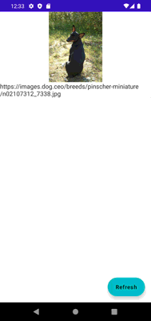
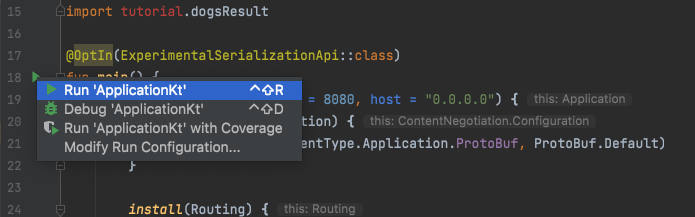

# Protobuf Kotlin Android Sample

This is a sample project to showcase the new [Kotlin support for protocol buffers](https://developers.googleblog.com/2021/11/announcing-kotlin-support-for-protocol.html). The data for the random dog is supplied by [https://dog.ceo/dog-api/](https://dog.ceo/dog-api/) with the [random dog API](https://dog.ceo/dog-api/documentation/random)

## Libraries 

* [Retrofit](https://square.github.io/retrofit/) - used for http android client
* [Protobuf gradle plugin - github](https://github.com/google/protobuf-gradle-plugin)
* [Ktor](https://ktor.io/) - backend server to return a simple result

## Module Structure

## Quick File Links

* [Dog proto file](https://github.com/plusmobileapps/protobuf-kotlin-sample/blob/main/model/src/main/proto/dog.proto)
* [Backend endpoint returning protobuf](https://github.com/plusmobileapps/protobuf-kotlin-sample/blob/main/backend/src/main/java/com/plusmobileapps/backend/Application.kt)
* Client [retrofit protobuf creation](https://github.com/plusmobileapps/protobuf-kotlin-sample/blob/main/app/src/main/java/com/plusmobileapps/protobufkotlin/di/DI.kt) and [DogService](https://github.com/plusmobileapps/protobuf-kotlin-sample/blob/main/app/src/main/java/com/plusmobileapps/protobufkotlin/network/DogService.kt)

## How to Run

Since this project has a local ktor server to return a simple result of dogs to the Android client. The fastest way to get this server up and running is by clicking on the play button next to the [Application.kt](https://github.com/plusmobileapps/protobuf-kotlin-sample/blob/main/backend/src/main/java/com/plusmobileapps/backend/Application.kt) `main()` function. Then you can run the app on an **emulator** to get the response. The retrofit client is specifically pointed at the local host ip address for an emulator, if you use a physical device you will need to update the [baseUrl](https://github.com/plusmobileapps/protobuf-kotlin-sample/blob/main/app/src/main/java/com/plusmobileapps/protobufkotlin/di/DI.kt#L10) appropriately.

